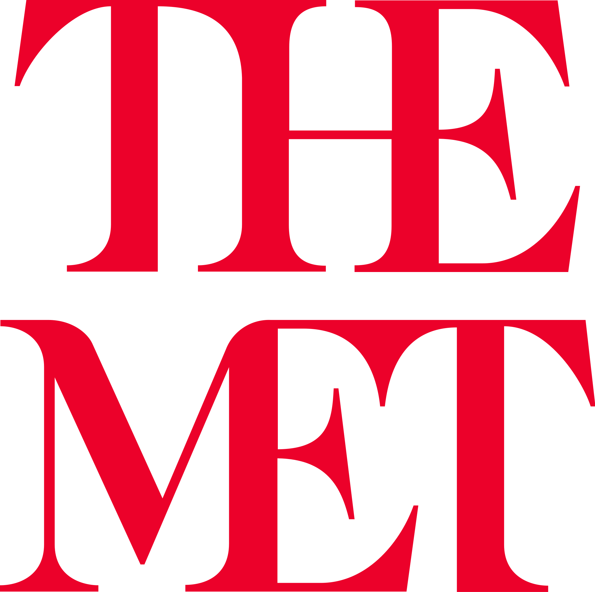
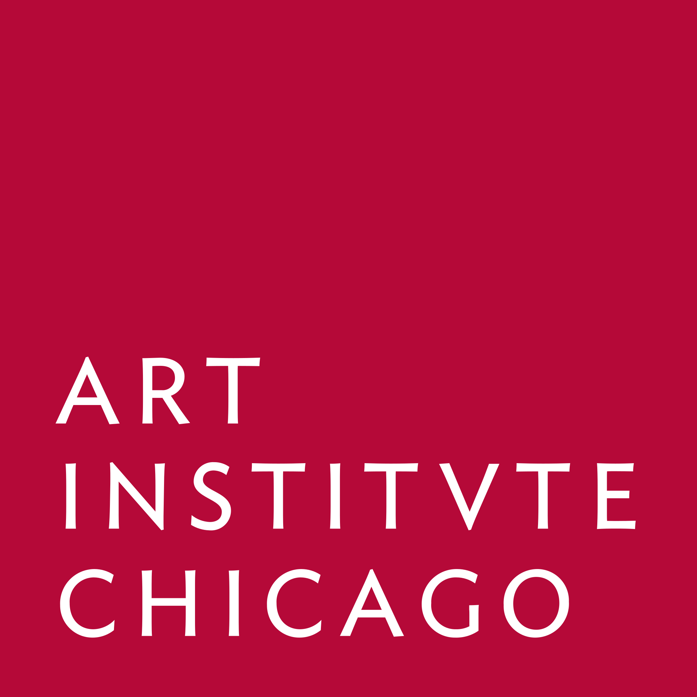
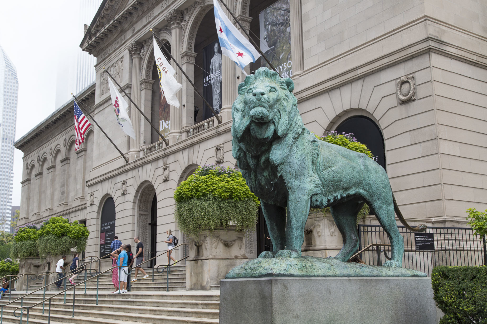
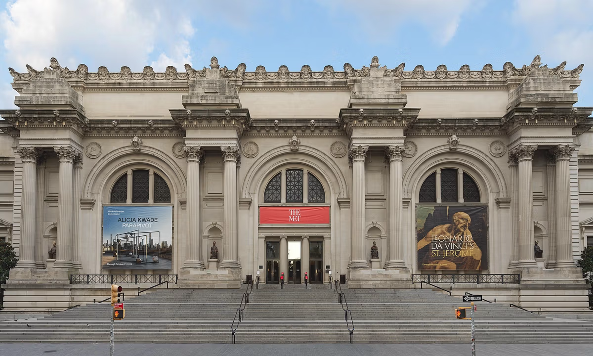

<h1 align="center" style="color: blue;">
    An Examination of The Met and Art Institute of Chicago's Colonial Past, Oligarchy-Driven Expansion, and Representation Bias
</h1>

<p align="center">
    
    
    
</p>

## Project Overview

This project investigates the histories and collections of two of the United States' most prominent art museums: the Art Institute of Chicago and The Metropolitan Museum of Art (The Met) in New York. By leveraging data analysis and visualization, the project cross-examines the provenance, acquisition patterns, and collection trends of both institutions, providing new insights into their development and the broader context of museum history in the US.

## Museum Histories

### Art Institute of Chicago
Founded in 1879, the Art Institute of Chicago is one of the oldest and largest art museums in the United States. Its collection spans continents and millennia, with particular strengths in Impressionist and Post-Impressionist art, American art, and ancient artifacts. The museum has played a significant role in shaping the cultural landscape of Chicago and has been at the forefront of provenance research and public engagement.

<p align="center">
	<br>
	<span>Art Institute of Chicago</span>
</p>

### The Metropolitan Museum of Art (The Met)
Established in 1870, The Met is the largest art museum in the US and one of the most visited in the world. Its encyclopedic collection covers over 5,000 years of art from every part of the globe. The Met has been instrumental in defining museum practices, collection strategies, and public education in the US and internationally.

<p align="center">
	<br>
	<span>The Met, NY</span>
</p>

## Data Analysis Approach

To cross-examine the histories and collections of the Art Institute of Chicago and The Met, this project employs a range of data science techniques:

- **Data Collection & Cleaning:** Publicly available datasets from both museums were gathered, cleaned, and standardized to enable direct comparison. This included provenance records, acquisition dates, object metadata, and geographic information.

- **Exploratory Data Analysis:** Using Python and Jupyter notebooks, the project explores trends in acquisitions, collection growth, and the geographic and temporal distribution of artworks. Visualizations highlight similarities and differences in collecting practices and institutional priorities.

- **Geospatial Analysis:** Geographic data is used to map the origins of artworks and visualize the global reach of each museum's collection. This helps reveal patterns in acquisition sources and historical collecting networks.

- **Temporal Analysis:** Time-series analysis tracks how each museum's collection evolved over decades, identifying periods of rapid growth, shifts in focus, and responses to historical events.

- **Machine Learning & Feature Extraction:** Embedding models and classification algorithms are used to analyze object descriptions, categorize artworks, and uncover latent patterns in the data.

- **Cross-Institutional Comparison:** By aligning datasets and applying consistent analytical methods, the project directly compares the two museums' histories, highlighting convergences and divergences in their development and collecting strategies.

## Repository Structure

- **Art Institute of Chicago/**: Data and analysis for the Art Institute of Chicago, including enhanced provenance research and Jupyter notebooks.
- **The Met/**: Data, visualizations, and models for The Met, including geospatial and temporal analyses.
- **Proposals/**: Research proposals and reports for both museums and related institutions.

## Getting Started

1. Clone the repository:
	```bash
	git clone https://github.com/RichardJiang736/US-Museums-Historical-Examinations.git
	```
2. Install required Python packages (see individual notebooks for dependencies).
3. Explore the Jupyter notebooks in `Art Institute of Chicago/` and `The Met/` for data analysis and visualization.

## Notebooks

- `Art Institute of Chicago/main.ipynb`, `Art Institute of Chicago/data_analysis.ipynb`: Analysis of Art Institute of Chicago provenance and collection data.
- `The Met/data_vis.ipynb`, `The Met/data_geo_epoch_vis.ipynb`: Visualizations and geographic/temporal analysis for The Met's collection.

## Data Sources

- Publicly available museum datasets (see individual folders for details).
- Enhanced provenance research data.

## Reports

Research proposals and reports are available in the `Proposals/` directory.

## License

This project is for academic and research purposes. Please cite appropriately if using the data or analysis.
